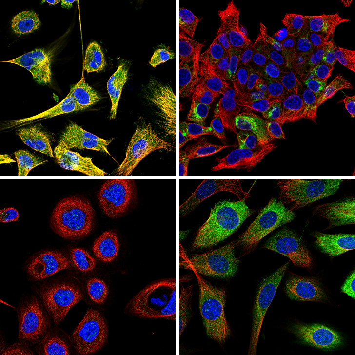
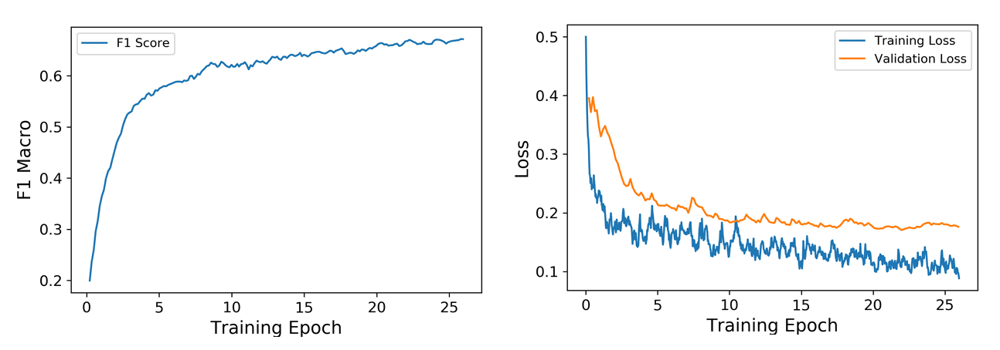

# Image Classification with Deep Convolutional Neural Networks

In this project, I use data from [Kaggle's Human Protein Classification competition](https://www.kaggle.com/c/human-protein-atlas-image-classification) and train a deep convolutional neural network to identify various types of proteins in microscopic images. The model achieves an F1 score of 0.471 on the test set, which is **in the top 15% of the final leaderboard** of the competition.

Since each image may contain more than one type of protein (28 in total), this is a multi-class multi-label classification problem. So, I slightly modify the standard **ResNet50** architecture, to suit the multi-label nature of the problem. More specifically, I use a binary cross enthropy loss function and traet the problem as 28 separate binary classification problems.

Efficiently handling big datasets is an importnat part of training CNNs on large datasets. In this case, the data takes up **more than 30GB** on disk and contains nearly 100K images. Since **the data is too large to fit in memory**, I design a data pipeline that loads the images gradually during training from a Google Cloud Storage bucket.

I use random flipping and rotation to augment the training data. My experiments indicate that this improves the performance of the model significantly. To address the problem of imbalance in the data, I optimaize the classification threshold for each class by searching for the empirically optimal threshold in the validation set.

Given that training multiple models for hyperparameter search is computatinally expensive, I **manually tuned the learning rate** during training, lowering it whenever the validation loss stopped improving. The following graphs show training and validation losses along with macor F1 Score. F1 score combines precision and recall and is a more suitable performace metric than accuracy, in problems with class imbalanced.

Training is done on a single Tesla P100 GPU on Google Cloud ML Engine. The complete Tensorflow training code is available [here](https://github.com/MiladShahidi/Kaggle-Protein-Classification/blob/master/trainer/model.py).